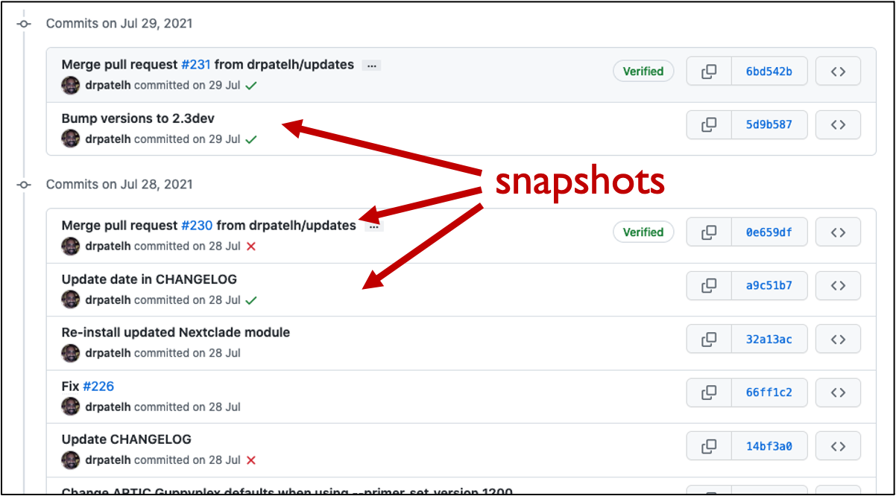
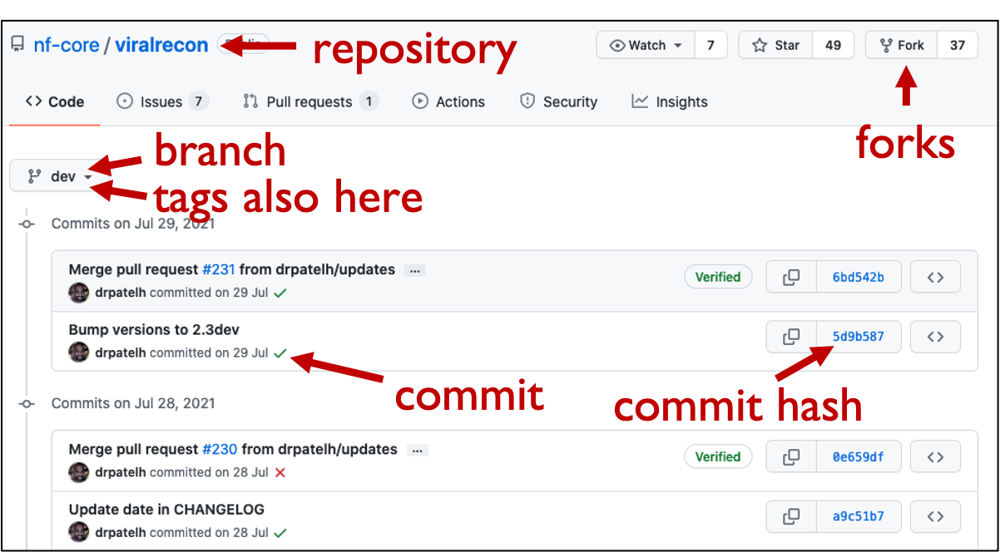

> ### Introduction to the lesson
> This tutorial provides a brief but hands-on introduction to the concept of version control, Git in RStudio, and
> GitHub. Git is a version control system which allows files and data to be tracked and synchronized,
> which allows collaboration and reproducibility.
> GitHub is a popular website that stores these repositories.
>
> **This tutorial avoids using the command line.** Instead, we will practice the basics of Git using Rstudio and later on we will also introduce GitHub. In many cases, this is enough. Git in Rstudio and GitHub provide collaboration tools to all kinds of projects, and there are all kinds of good ways to use it.
>
> This serves as an introduction to Git. After this lesson, you will both be able to use Git, and feel much more confident taking a command-line Git course such as [CodeRefinery’s git-intro course](https://coderefinery.github.io/git-intro/).
>
> What we will not cover
> * Command line interface
> * Cloning using SSH protocol and SSH keys
> * Rebasing and squashing
> * Many Git tricks which can be explored later
{: .callout}

> ## Why GitHub?
>
> We will do this exercise on [GitHub](https://github.com) but also
> [GitLab](https://gitlab.com) and [Bitbucket](https://bitbucket.org) allow
> similar workflows and basically everything that we will discuss is transferable. With
> this material and these exercises we do not endorse the company
> [GitHub](https://github.com). We have chosen to demonstrate a number of
> concepts using examples with [GitHub](https://github.com) because it is
> currently the most popular web platform for hosting Git repositories and the chance is high
> that you will interact with [GitHub](https://github.com)-based repositories even if you
> choose to host your Git repository on another platform.
>
> We also encourage course participants to use CodeRefinery’s [Nordic research software repository platform](https://source.coderefinery.org),
> for more information see [https://coderefinery.org/repository/](https://coderefinery.org/repository/).
{: .solution}

## Version control in general

  
*from: Wit and wisdom from Jorge Cham (http://phdcomics.com/)*

> ## Exercise 1: Problems with change (5 min)
>
> Which of these issues can you relate to?
> 
> * I have fifteen versions of this file - which one do I use?
> * I can’t remake this figure from last year
> * I slightly modified my code in one place, everything stopped working
> * I have several copies of the same directory because I'm worried about breaking something
> * Somebody added erroneous records in a shared file with samples, cannot find who and why
> * You remember seeing a data file but cannot find it anymore: is it deleted? Moved away?
> * I tried multiple analysis and I don't remember which one I chose to generate my output data
> * I have to merge changes to our manuscript from 10 different emails with collaborators
> * I accidentally deleted a part of my work
> * I came to an old project and forgot where I left/saved it
> * I reorganized my data files, but broke the analysis pipeline and don't know how to fix it
> * I have trouble to find the source of a mistake in an experiment
> * My directory is polluted with a lot of unused/temporary/old folders because I'm afraid of losing something important
> * I made a lot of changes to my paper but want to bring back one paragraph
{: .challenge}

- Version control is a tool that can **record snapshots of a project**.
- You can think of version control like regularly taking a photo of your work
  (movie sets take regular polaroids to be able to recreate a scene the next day).

Snapshots (**commits**) in the [nf-core/viralrecon](https://github.com/nf-core/viralrecon/) repository.

### What we typically like to snapshot

- Software (this is how it started but Git/GitHub can track a lot more)
- Scripts
- Documents (plain text file much more suitable than Word documents)
- Manuscripts (Git is great for collaborating/sharing LaTeX manuscripts)
- Configuration files
- Website sources
- Data

### Why are snapshots valuable? Reproducibility!

- We can always go back if we make a mistake.
- We have the means to refer to a well-defined version of a project when sharing, collaborating, and publishing.
- If we discover a problem, we can find out when it was introduced.

## Version control with Git and GitHub

### Difference between [Git](https://git-scm.com) and [GitHub](https://github.com)

**Git**
- Tool that can record and synchronize snapshots.
- Not the only tool that can record snapshots (other popular tools are
[Subversion](https://subversion.apache.org) and [Mercurial](https://www.mercurial-scm.org)).
- Not only a tool but also a format that can be read by many different tools.

**GitHub**
- Service that provides hosting for Git repositories with a nice web interface.
- Not the only service that provides this (other popular services are
[GitLab](https://about.gitlab.com/) and [Bitbucket](https://bitbucket.org)).

**GitHub Desktop**
- Graphical user interface to Git and GitHub which runs locally on your computer.
- There are other tools that can do this too (e.g. [Sourcetree](https://www.sourcetreeapp.com/)).

### Commits, branches, repositories, forks, clones

- **repository**: The project, contains all data and history (commits, branches, tags).
- **commit**: Snapshot of the project, gets a unique identifier (e.g. `c7f0e8bfc718be04525847fc7ac237f470add76e`).
- **branch**: Independent development line, often we call the main development line `main`.
- **tag**: A pointer to one commit, to be able to refer to it later. Like a sticky note that you attach to a particular commit (e.g. `phd-printed` or `paper-submitted`).
- **cloning**: Copying the whole repository to your laptop - the first time. It is not necessary to download each file one by one.
- **forking**: Taking a copy of a repository (which is typically not yours) - your
  copy (fork) stays on GitHub and you can make changes to your copy.

GitHub file view of the
[nf-core/viralrecon](https://github.com/nf-core/viralrecon/)
repository.  This is the version of all files at a single point in
time.

Github history view of the
[viralrecon](https://github.com/nf-core/viralrecon/commits/master)
repository.  This is the progression of the repository (with the
**commit message** over time).

Network graph of all commits in the
[nf-core/viralrecon](https://github.com/nf-core/viralrecon/network)
repository.  This shows the relationship between different **forks**
of people who are contributing and sharing code.

### Interesting repositories to explore these concepts

- Assembly and intrahost/low-frequency variant calling for viral samples
  - Repository: <https://github.com/nf-core/viralrecon/>
  - Commits, branches, forks: <https://github.com/nf-core/viralrecon//network>
- Swedish COVID-19 data portal
  - Repository: <https://github.com/ScilifelabDataCentre/covid-portal>
  - Commits, branches, forks: <https://github.com/ScilifelabDataCentre/covid-portal/network>
- [Activity inequality study](http://activityinequality.stanford.edu/)
  - Contains data and code necessary to create figures from their article.
  - Data: <https://github.com/timalthoff/activityinequality/tree/master/data>
- FiveThirtyEight story [Why We’re Sharing 3 Million Russian Troll Tweets](https://fivethirtyeight.com/features/why-were-sharing-3-million-russian-troll-tweets/)
  - Contains data and readme file, no code.
  - Data: <https://github.com/fivethirtyeight/russian-troll-tweets>
- The NY Times Coronavirus (Covid-19) Data in the United States
  - Contains data, readme, license, but no code.  As of 2020 April,
    being updated every day.
  - Data: <https://github.com/nytimes/covid-19-data>
  - Website: <https://www.nytimes.com/interactive/2020/us/coronavirus-us-cases.html>
- CSV exports of the Getty Provenance Index
  - Data: <https://github.com/thegetty/provenance-index-csv>
- Entire books are written using Git/GitHub:
  - <https://github.com/rust-lang/book>
  - <https://github.com/ropensci/dev_guide>
  - <https://github.com/alan-turing-institute/the-turing-way>
- Papers under open review:
  - <https://github.com/openjournals/joss-reviews/issues>

---

> ## Why using repositories?
>
> - All changes are recorded.
> - We do not have to send changes via email.
> - We can experiment with several ideas which might not work out (using branches).
> - Several people can work on the same project at the same time (using branches).
> - We do not have to wait for others to send us "the latest version" over email.
> - We do not have to merge parallel developments by hand.
> - Group-based access model where shared access is the default, instead of
>   everything fundamentally owned by individuals who manage sharing as-needed:
>   with Git you can easily have collaboration be the default.
> - It is possible to serve websites directly from a repository.
{: .callout}

> ## Discussion
>
> - How have you solved these in the past without version control?
{: .discussion}
