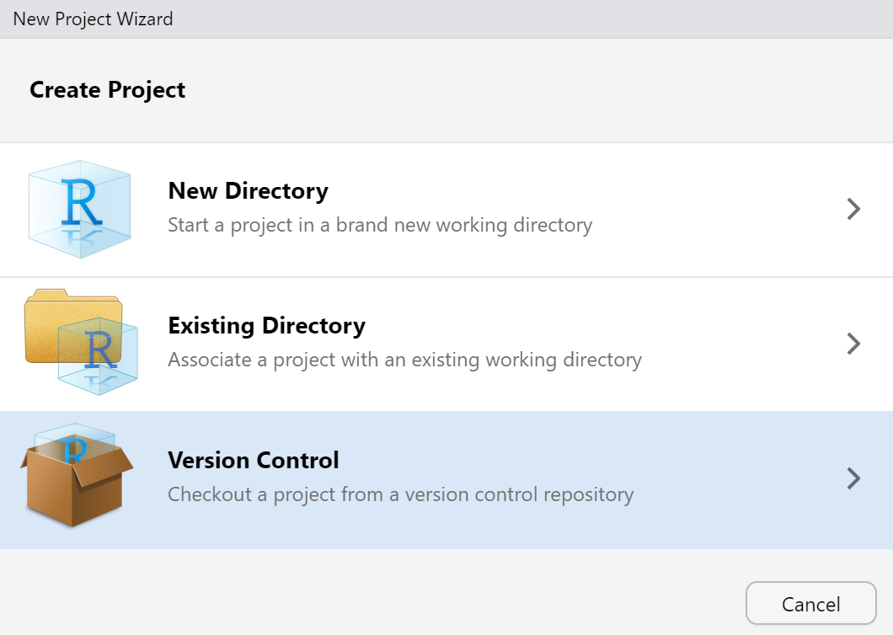



> ### Warning: This lesson *may* not work
> The preparations for this episode was unintentionally left out of the precourse instructions. Please refer to the [Local versioning with Git in GitHub Desktop]({{relative_root_path}}) instead. The course organisers will follow-up with instructions to make this exercise work as described.
> 
{: .prereq}

> ### About this episode
>
> In this last section we will practice two cases:
>
> 1.  How to connect your local repository in RStudio with GitHub.
> 2.  How to connect your remote repository on GitHub with your local
>     repository in RStudio.
>
> Furthermore, we will try how we can push and pull commits in different
> scenarios. 
{: .callout}

### Example 1: How to push your local repository to GitHub?

In the first section of this module we stated that no command-line
should be used. Well, that is almost true. In order to push an existing
RStudio project to GitHub we need to copy two lines of code into the so
called shell of RStudio.

1.  Open your web browser and navigate to GitHub.
2.  Create a new repository
3.  Give the repository the same name as your RStudio project.
4.  **Uncheck** the option "Initialize this repository with a README".
5.  Click on "Create Repository".
6.  Copy the lines of code from the box labeled "Push an existing
    repository from the command line".
7.  Open your existing project in RStudio.
8.  Verify that the Git tab is active and using Git.
9.  Open a shell in RStudio by clicking on "Tools" -\> "Shell".
10. Paste the lines of code that you copied earlier into the shell and
    press enter.

You have now pushed your local repository to GitHub. Refresh the
repository in your web browser and peruse your achievements! From now on
you can work in RStudio as usual. When you make new commits you can also
push them to GitHub.

### Example 2: How to clone your remote repository from GitHub to your local computer in RStudio?

Suppose you initially set up a repository on GitHub to begin versioning
your project. If you later decide to continue working on your project
using RStudio instead of the GitHub web interface, you can create a "New
Project" in RStudio and clone your GitHub repository. The process is
similar to the steps outlined in the second section, where we initiated
versioning locally on your computer. However, instead of creating a "New
Directory" we choose "Version Control".

1.  Copy the URL from your GitHub repository
2.  Start a **New Project** and choose **Version Control**.
3.  Choose **Git**.
4.  Copy the URL from your GitHub repository to "Repository URL" and
    choose a convenient location for the new project.
5.  Click on **Create Project**

Done! You have now connected your GitHub repository with your local
computer. From now on you can work in RStudio as usual. When you make
new commits you can also push them to GitHub.

#### 1. Copy the URL from your GitHub repository

#### 2. Start a New Project in RStudio and choose Version Control

#### 3. Choose Git

#### 4. Paste the URL from your GitHub repository and choose a convenient location for the new project.

------------------------------------------------------------------------

Try to make a new commit in your local repository and push it to your
remote repository. Update your GitHub page and see what has happened.
How can you do the other way around?

