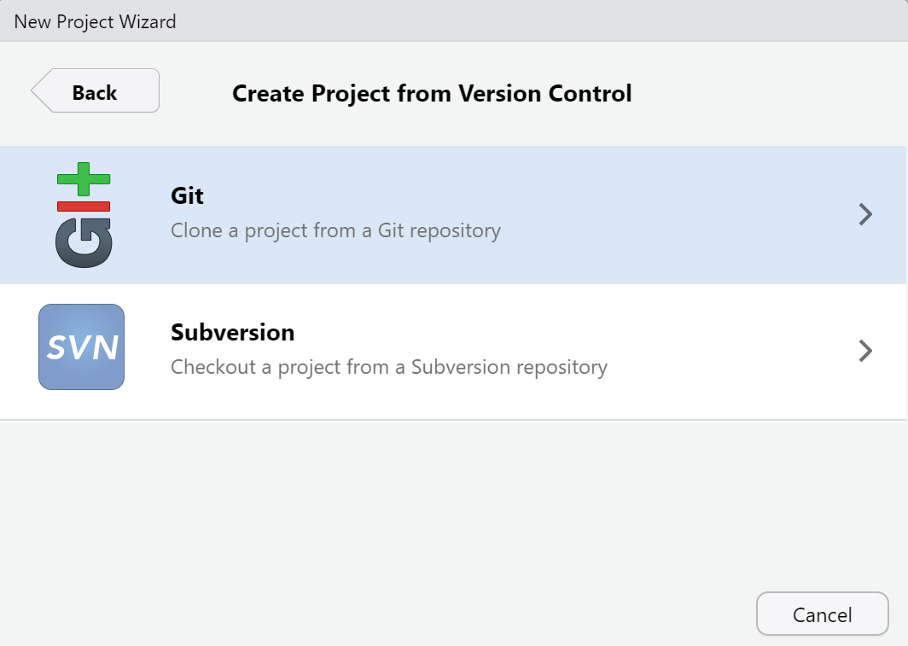
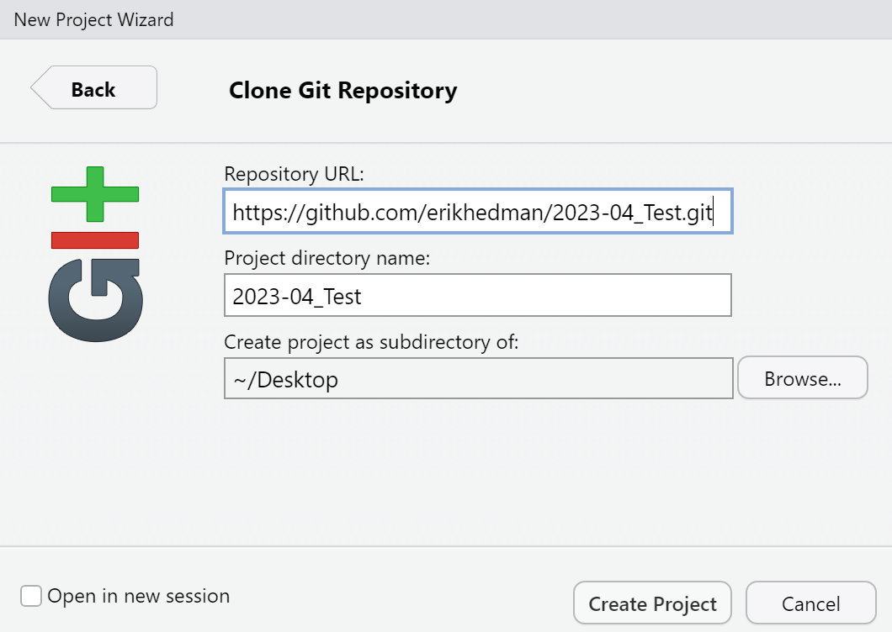
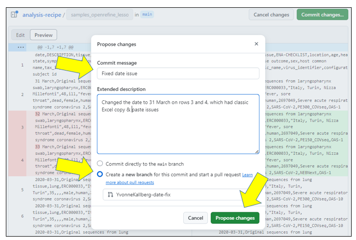
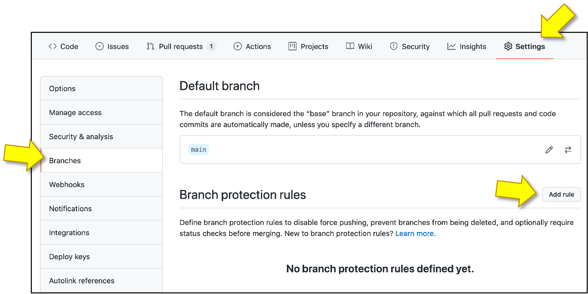
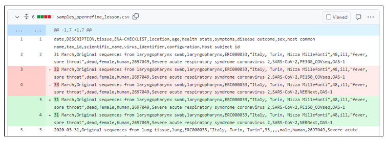

> ### About this episode
> In this last section we will practice two cases:
>
> 1. How to connect your local repository in RStudio with GitHub.
> 2. How to connect your remote repository on GitHub with your local computer in RStudio.
>
> Furthermore, we will try how we can push and pull commits in different scenarios.
{: .callout}


### Example 1: How to push your local repository to GitHub?

In the first section of this module we stated that no command-line should be used. Well, that is almost true. In order to push an existing RStudio project to GitHub we need to copy two lines of code into the so called shell of RStudio.

1. Open your web browser and navigate to GitHub.
2. Create a new repository
3. Give the repository the same name as your RStudio project.
4. **Uncheck** the option "Initialize this repository with a README".
5. Click on "Create Repository".
6. Copy the lines of code from the box labeled "Push an existing repository from the command line".
7. Open your existing project in RStudio.
8. Verify that the Git tab is active and using Git.
9. Open a shell in RStudio by clicking on "Tools" -> "Shell".
10. Paste the lines of code that you copied earlier into the shell and press enter.

You have now pushed your local repository to GitHub. Refresh the repository in your web browser and peruse your achievements! From now on you can work in RStudio as usual. When you make new commits you can also push them to GitHub. 


### Example 2: How to clone your remote repository from GitHub to your local computer in RStudio?

Suppose you initially set up a repository on GitHub to begin versioning your project. If you later decide to continue working on your project using RStudio instead of the GitHub web interface, you can create a "New Project" in RStudio and clone your GitHub repository. The process is similar to the steps outlined in the second section, where we initiated versioning locally on your computer. However, instead of creating a "New Directory" we choose "Version Control".

1. Copy the URL from your GitHub repository
2. Start a **New Project** and choose **Version Control**.
3. Choose **Git**.
4. Copy the URL from your GitHub repository to "Repository URL" and choose a convenient location for the new project.
5. Click on **Create Project**

Done! You have now connected your GitHub repository with your local computer. From now on you can work in RStudio as usual. When you make new commits you can also push them to GitHub.
\
\

#### 1. Copy the URL from your GitHub repository

\
\

#### 2. Start a New Project in RStudio and choose Version Control

\
\

#### 3. Choose Git

\
\

#### 4. Paste the URL from your GitHub repository and choose a convenient location for the new project.

\
\

---

Try to make a new commit in your local repository and push it to your remote repository. Update your GitHub page and see what has happened. How can you do the other way around?

---

In this exercise we will not change the `main` branch directly but
we will submit a "pull request" (a **change proposal**) towards the `main` branch
for **code review**.

**Exercise**: We will practice this by suggesting a change in a data file:

- Instructor shares an example repository and adds a volunteer learner as collaborator
- Learner shares screen and edits `samples_metadata_lesson.csv` via web (click on the edit pen)
- We modify or extend one row in the data file from the example repository together by guiding the volunteer learner
- We do not commit directly to `main` but rather "Create a new branch for this commit and start a pull request."
- We choose a meaningful branch name (it can be useful to prefix it with your name so that we know who this branch belongs to)



- After we click "Propose file change" we are taken to this form:


- In there we verify the **source and target branch**, verify the **file changes**,
  can edit the **title** and **description** of the "pull request" (change proposal)
- After we have submitted the "pull request", one of our collaborators can review it
- We can discuss and ask for changes before merging the changes "Merge pull request"

> ## Discussion
>
> - Ideally submitter and reviewer should be two different persons.
>   When is this best? When not?
> - You can modify an open "pull request" by committing new changes to the branch
> - Review is not only to assure quality but also to enhance learning and **knowledge transfer** within the group
{: .discussion}

---

To make sure that *all* changes of the `main` branch are reviewed and nobody
can push commits to it directly, it can be useful to "protect" branches.

- "Settings", then "Branches", then "Add rule":



> ## Tips
>
> - Protecting the `main` branch "forces" all changes to it to be reviewed first.
>   **We recommend this for group repositories**.
>   Discuss the advantages/disadvantages of this.
{: .callout}


## Step 3: Submit a small change via the web interface as external contributor

Submitting a change proposal as external contributor (we assume you are not added
as "collaborator" and thus have no write-permissions to a repository) looks very similar
to submitting a "pull request" to a repository with a protected `main` branch.
Only this time you have no other choice than "Propose file change".

Let's try this with one participant who has not been added as collaborator
sharing screen:
- Edit a file with the "pen" button
- Edit the commit message and click green button "Propose file change"
- This creates a **fork** of the repository (GitHub makes a copy of the original repository to your user space)
- You can now still review the change before submitting it, green button "Create pull request"
- Later you can remove the fork if you like


## Step 4: Resolving a conflict

```{instructor-note}
- "Non-talking instructor" prepares a conflicting commit during session (check
  what the first PR does).
- Conflict can be shown as demo.
```

### Exercise/demo: let us experience a conflict

**When merging** two branches a conflict can arise when the same file **portion**
has been modified in two **different** ways on the two branches.

We can practice how a conflict looks and how to resolve it:
- Two participants should send two "pull requests" (change proposals)
  branching from `main` changing the same line in two different ways




- We merge together one of the pull requests (this will work)
- Then we try to merge the other and we see a conflict:


- We try to resolve the conflict via web
- Choose the version that you wish to keep, remove conflict markers, "Mark as resolved" and commit the change


> ## Discussion
>
> - Compare with Google Docs: can you get conflicts there? What are the advantages and disadvantages?
> - What can we do to avoid conflicts?
{: .discussion}


> ## Summary
>
> - In this episode we learned how to propose changes and submit changes via "pull requests".
> - If you track and collaborate on text files it can be useful to wrap lines. If the entire
>   paragraph is one long line, if will be more difficult to see what changed,
>   and you risk seeing more conflicts.
> - Protecting the `main` branch and insisting on every change going
>   through a pull request can be useful to get feedback on your changes
>   and to improve knowledge transfer.
> - For controversial changes it can
>   be useful to first discuss in an issue before submitting the changes.
> - Note that you can mark pull requests as draft to collect feedback on unfinished work.
> - Now that you know how to send improvements, we welcome
>   improvements to [this material](https://github.com/coderefinery/github-without-command-line) also.
{: .callout}
